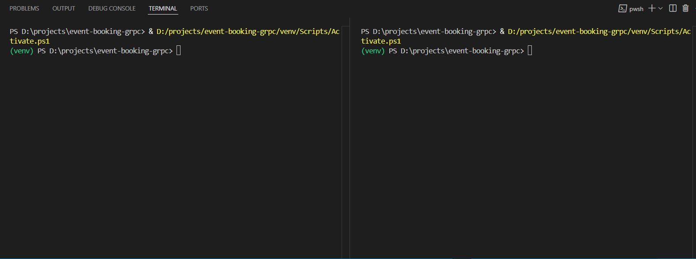

# 🎟️ gRPC Event Booking System  

A **high‑performance microservice** for managing events and ticket bookings, built with **Python**, **gRPC**, **Protocol Buffers**, and **SQLite**.  

🎟️ gRPC Event Booking System
A high‑performance microservice for managing events and ticket bookings, built with Python, gRPC, Protocol Buffers, and SQLite.
Users can create events, book tickets, cancel bookings, and list events via a Rich‑powered CLI client.

✨ Features
1-Create Events with name & capacity.

2-Book Tickets with capacity checks (no overbooking).

3-Cancel Bookings with confirmation.

4-List All Events with current booking status.

5-Persistent Storage using SQLite (data remains after restart).

6-Beautiful CLI using Rich.

7-Proper gRPC Error Handling (e.g., invalid IDs, full events).

📂 Project Structure
graphql

EVENT-BOOKING-GRPC/
│
├── event_booking/                 # gRPC proto & generated files
│   ├── event_booking.proto        # Service definitions
│   ├── event_booking_pb2.py       # Generated protobuf code
│   ├── event_booking_pb2_grpc.py  # Generated gRPC stubs
│   └── __init__.py
│
├── client.py                      # Interactive CLI client
├── server.py                      # gRPC server with SQLite backend
├── events.db                      # SQLite database
├── requirements.txt               # Dependencies
├── README.md                      # Documentation
└── .gitignore                     # Ignore venv/db backups
🚀 Quickstart

1️⃣ Clone the repository
git clone https://github.com/shubham-711/event-booking-grpc.git

-cd event-booking-grpc

2️⃣ Create & activate a virtual environment

-python -m venv venv
# On Windows:
-venv\Scripts\activate
# On Mac/Linux:
-source venv/bin/activate

3️⃣ Install dependencies

pip install -r requirements.txt

4️⃣ Generate gRPC Python code

python -m grpc_tools.protoc -I event_booking, --python_out=event_booking --grpc_python_out=event_booking,  event_booking/event_booking.proto

5️⃣ Start the server

python server.py

6️⃣ Run the client (in a new terminal)

python client.py

🎥 Demo
(Server & Client running side by side)

🛠 Example Commands

Create Event

python client.py create --name "DEMO" --tickets 50

Book Tickets

python client.py book --id <id generated> --tickets 5

List Events

python client.py list

🔮 Future Enhancements

Real‑time streaming for live booking updates.

User authentication & roles (Admin vs Attendee).

Dockerfile for easy containerized deployment.

⭐ If you like this project, don’t forget to Star the repository!
